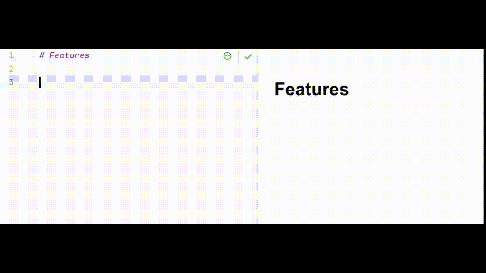

# OpenFastTrace IDE Templates

This project contains IDE templates for creating [OpenFastTrace](https://github.com/itsallcode/openfasttrace) artifacts faster with IDEs.

1. [Eclipse WikiText Editor Templates](#eclipse)
2. [IntelliJ / PyCharm / CLion Live Templates](#intellij-idea--pycharm--clion)

These templates configure auto-completion features of your IDE so that you can create artifacts like features, system requirements and design more quickly and safely.

## Eclipse

### Wikitext Templates

One of the available Markdown Editors for [Eclipse](https://www.eclipse.org/) that works really well is the built-in Wikitext Editor.

#### Installation Steps for the Eclipse WikiText Editor Templates:

1. Download the template export file from [`wikitext_editor_templates/templates.xml`](wikitext_editor_templates/templates.xml) in this repository.
2. In the Eclipse menu choose `Window` → `Preferences`
3. In dialog `Preferences`:
   1. Search for `Templates`
   2. Find the section under `WikiText`
   3. In the `Templates` sub-dialog on the right
      1. Click `Import…`
      2. Pick the downloaded template file
   4. Click `Apply and Close`

#### Using the Templates in the WikiText Editor

When working on a Markdown file with the WikiTextEditor simply type the first few letters of the template (three is usually enough) and hit the auto-complete shortcut (`CTRL` + `SPACE BAR` by default).

If there are multiple matches pick the right one from the list.

Fill in one placeholder after the other cycling through them with the TAB key.

## IntelliJ IDEA / PyCharm / CLion

The Live Templates work for _all_ products from the [JetBrains IDE](https://www.jetbrains.com/ides/) line.

#### Installation Steps for the IntelliJ IDEA / PyCharm / CLion Live Templates:

1. Open the Live Templates Export [`jetbrains_ide_live_templates/oft_live_templates.xml`](jetbrains_ide_live_templates/oft_live_templates.xml) from this repository.
2. Copy the entire XML content to your clipboard.
3. Open IntelliJ IDEA / PyCharm / CLion.
4. Navigate to `File` → `Settings` (on Windows and Linux) or `IntelliJ IDEA` → `Preferences` (on macOS).
5. In the Settings/Preferences dialog, select `Editor` → `Live Templates`.
6. Add a template group (Click the `+` or type button or `[ALT] + [INS]`) and name it "OpenFastTrace".
7. Select the newly created template group.
8. Paste the clipboard contents into the template group.

Note, that while strictly speaking the file is not valid XML — since it has multiple root elements — this still works fine and is the simplest way to import the templates available. 

#### Using the Live Templates in IntelliJ IDEA / PyCharm / CLion

When working on a Markdown file in IntelliJ IDEA, simply begin typing the first few letters of the template abbreviation (three is usually enough), then press the code completion shortcut (`CTRL` + `SPACE` by default).

If there are multiple matches, select the appropriate one from the list.

Fill in one placeholder at a time. You can move to the next placeholder by pressing the `TAB` key.

#### Sharing IntelliJ IDEA Live / PyCharm / CLion Templates with Settings Synchronization:

Once you've imported Live Templates in one environment, you can avail these templates in other IntelliJ IDEA environments using the Settings Sync feature. Here are the steps to achieve this:

1. After importing the Live Templates, go to `File` → `Manage IDE Settings` → `Settings Repository…`.
2. In the `Settings Repository` dialog, enter the URL of your private remote Git repository where you want to store your settings.
   - If you're doing this for the first time, click on `Overwrite Remote` to push your current settings (including Live Templates) to the remote repository.
   - If you've already done this before, and you're on a different environment where you want these settings, click on `Overwrite Local`. This updates your local IDE settings with the ones stored in your remote repository.
3. Repeat step 2 on any other IntelliJ IDEA environments where you want these Live Templates.

Please ensure your remote repository is kept private as it might contain sensitive IDE settings. This feature is a more advanced feature, make sure you're comfortable with Git's basic concepts.